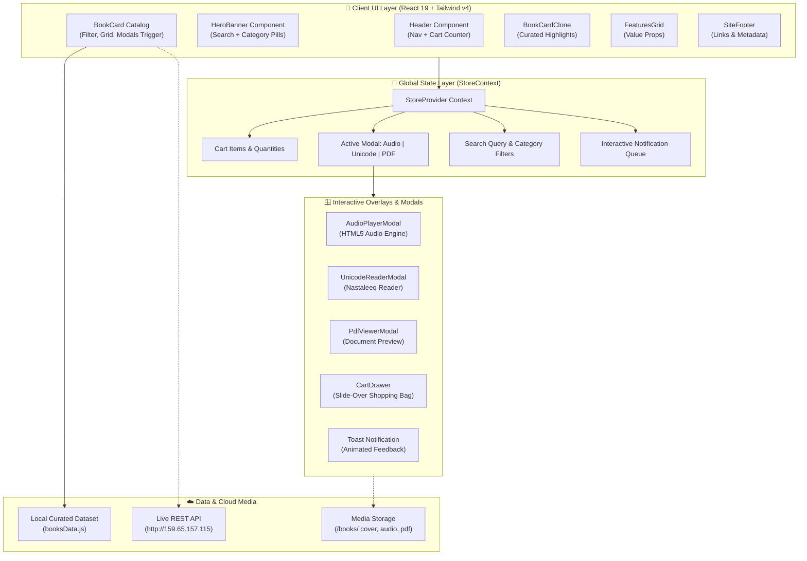
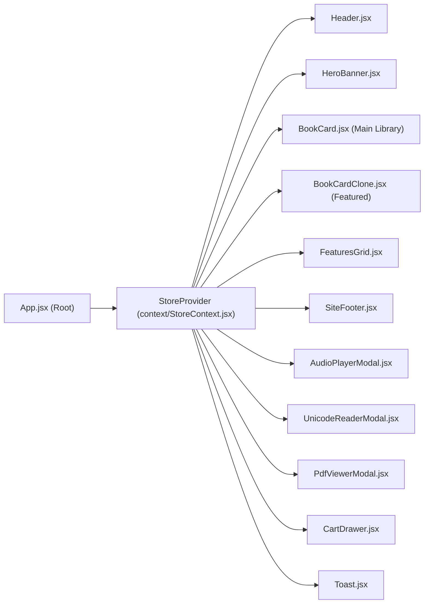

<div align="center">

# 📚 KitabGhar Digital (کتاب گھر)
### *A Next-Generation Digital, Audio & Unicode Urdu Bookstore*

[](https://react.dev/)
[](https://vitejs.dev/)
[](https://tailwindcss.com/)
[](http://159.65.157.115/)
[](LICENSE)

<br />


<br />

**KitabGhar Digital** is an elegant, full-featured digital bookstore web application designed to showcase authentic Urdu, classical literature, and multilingual publications. Built with **React 19**, **Vite 8**, and **Tailwind CSS v4**, it integrates an in-browser **HTML5 Audio Player**, searchable **Unicode Nastaleeq Reader**, **PDF Viewer**, dynamic **Shopping Cart**, and live **REST API** streaming.

[Explore Features](#-key-features) • [Architecture](#-system-architecture) • [Live API Endpoints](#-live-rest-api-endpoints) • [Getting Started](#-getting-started) • [Student & Teacher Guide](#-pedagogical-guide-semantic-html--jsx)

</div>

---

## 🌟 Key Features

<table>
  <tr>
    <td width="50%">
      <h3>🎧 Studio Audiobook Streaming</h3>
      <p>Custom in-browser HTML5 audio player modal with dynamic track playback, audio scrubber, volume adjustment, and cover art display for narrated classics.</p>
    </td>
    <td width="50%">
      <h3>📖 Unicode Nastaleeq Reader</h3>
      <p>Clean typography reader with Amiri and Noto Nastaliq Urdu fonts. Features real-time font scaling, line-height controls, chapter browsing, and text copying.</p>
    </td>
  </tr>
  <tr>
    <td width="50%">
      <h3>📄 Instant PDF Document Viewer</h3>
      <p>Direct in-modal PDF preview and official high-resolution document download links with fallback placeholders for offline reading.</p>
    </td>
    <td width="50%">
      <h3>🛒 Interactive Slide-Over Cart</h3>
      <p>Persistent global cart state powered by React Context. Supports item addition, real-time quantity controls, instant item removal, and auto-computed subtotals.</p>
    </td>
  </tr>
  <tr>
    <td width="50%">
      <h3>🔍 Real-Time Search & Category Filters</h3>
      <p>Instant title and author searching combined with multi-category filters (PDF Books, Unicode Literature, Audiobooks, All).</p>
    </td>
    <td width="50%">
      <h3>🌐 Live REST API & Cloud Storage</h3>
      <p>Full integration with remote Ubuntu/Nginx cloud server at <code>159.65.157.115</code> for dynamic catalog retrieval and media streaming.</p>
    </td>
  </tr>
</table>

---

## 🏗️ System Architecture

KitabGhar follows a unidirectional data flow powered by React 19's Context API and modular component architecture.



---

## 🗂️ Component Hierarchy & Flow



---

## 🌐 Live REST API Endpoints

The client seamlessly interacts with the production cloud API hosted at `http://159.65.157.115`:

| Resource | HTTP Method | Endpoint | Description |
| :--- | :---: | :--- | :--- |
| **PDF Books** | `GET` | `/api/books?bookType=PDF&page=1` | Official downloadable digitized PDF literature |
| **Unicode Books** | `GET` | `/api/books?bookType=UNICODE&page=1` | Searchable UTF-8 Nastaleeq text books |
| **Audiobooks** | `GET` | `/api/audiobooks?page=1` | Studio-narrated recordings with streamable MP3 URLs |
| **Single Book** | `GET` | `/api/books/:id` | Full metadata, synopsis, and chapter breakdown |
| **Cover Artwork** | `GET` | `/{coverPhotoUri}` | High-res cover image (URL-encoded for Urdu characters) |
| **PDF Document** | `GET` | `/{fileUri}` | Raw PDF file for in-app viewing or direct download |
| **Audio Track** | `GET` | `/{audioFilesUri[0]}` | Direct MP3 audio stream for HTML5 audio player |

> [!NOTE]
> All media endpoints handle Urdu Unicode paths gracefully using safe URL encoding strategies (`encodeURI` / `encodeURIComponent`).

---

## 💻 Tech Stack & Dependencies

| Layer | Technology | Version | Purpose |
| :--- | :--- | :--- | :--- |
| **Core Framework** | [React](https://react.dev/) | `^19.2.8` | Component-driven declarative UI |
| **Build Tool** | [Vite](https://vitejs.dev/) | `^8.3.0` | Ultra-fast HMR and ESM bundling |
| **Styling** | [Tailwind CSS](https://tailwindcss.com/) | `^4.3.3` | Modern utility-first styling engine |
| **Compiler Plugin** | [@vitejs/plugin-react](https://github.com/vitejs/vite-plugin-react) | `^6.1.1` | Fast Refresh with SWC/Babel |
| **CSS Integration** | [@tailwindcss/vite](https://tailwindcss.com/docs) | `^4.3.3` | Native Vite integration for Tailwind v4 |
| **Linter** | [Oxlint](https://oxc.rs/) | `^1.81.0` | Next-generation Rust-powered linter |
| **Typography** | Google Fonts | Web | *Amiri*, *Noto Nastaliq Urdu*, *Inter* |

---

## 🚀 Getting Started

### Prerequisites
- **Node.js**: v18.0.0 or higher (Tested on Node v20.x and v24.x)
- **npm** or **yarn**

### 1. Clone the Repository
```bash
git clone https://github.com/syedasjadabbas/Kitaab-Ghar.git
cd Kitaab-Ghar
```

### 2. Install Dependencies
```bash
npm install
```

### 3. Launch Development Server
```bash
npm run dev
```

The Vite dev server will start instantly:
```text
  VITE v8.3.3  ready in 410 ms

  ➜  Local:   http://localhost:5173/
  ➜  Network: use --host to expose
```

### 4. Build for Production
To create an optimized production bundle:
```bash
npm run build
```

Preview the production build locally:
```bash
npm run preview
```

> [!TIP]
> **Windows Path Compatibility**: On Windows environments where project folder paths contain special characters (such as spaces or ampersands `&`), the `package.json` scripts are pre-configured to execute Node directly against the Vite entry point, preventing shell delimiter collisions.

---

## 📁 Repository Structure

```text
Kitaab-Ghar/
├── docs/
│   └── banner.jpg               # Professional showcase banner
├── public/
│   ├── favicon.svg              # Bookstore favicon icon
│   ├── hero-bg.jpg              # Atmospheric library background
│   ├── icons.svg                # Scalable vector sprites
│   └── book-placeholder.svg     # Fallback book cover artwork
├── src/
│   ├── assets/                  # Brand graphics & SVGs
│   ├── components/              # Reusable React components
│   │   ├── Header.jsx           # Sticky glassmorphic navbar & cart counter
│   │   ├── HeroBanner.jsx       # Hero banner with Urdu typography & filter pills
│   │   ├── BookCard.jsx         # Primary catalog grid, filter engine & modals
│   │   ├── BookCardClone.jsx    # Featured books showcase section
│   │   ├── FeaturesGrid.jsx     # Four-column store value highlights
│   │   ├── SiteFooter.jsx       # Semantic footer with navigation links
│   │   ├── AudioPlayerModal.jsx # HTML5 Audiobook player with audio scrubber
│   │   ├── UnicodeReaderModal.jsx# Nastaleeq reader with font-size controls
│   │   ├── PdfViewerModal.jsx   # In-app PDF viewer & downloader
│   │   ├── CartDrawer.jsx       # Slide-over cart with quantity adjuster
│   │   └── Toast.jsx            # Animated feedback alerts
│   ├── context/
│   │   └── StoreContext.jsx     # Global state provider (Cart, Modals, Filters)
│   ├── data/
│   │   └── booksData.js         # Curated literature dataset & remote base URL
│   ├── App.jsx                  # Main application composition root
│   ├── App.css                  # Custom animations, card gradients & typography
│   ├── index.css                # Tailwind CSS v4 directives & font imports
│   └── main.jsx                 # React DOM createRoot entrypoint
├── package.json                 # Project configuration & scripts
├── vite.config.js               # Vite 8 & Tailwind v4 plugin setup
└── README.md                    # Project documentation
```

---

## 🎓 Pedagogical Guide: Semantic HTML & JSX

> [!IMPORTANT]
> ### 👨‍🏫 Teacher's Guide: Explaining "Native HTML vs. Custom JSX Components"
> 
> When learning React, students frequently ask:
> **"Why do some tags look like `<BookCard />` and `<Header />`, while inside them we write `<article>`, `<header>`, `<button>`, and `<p>`?"**

### 1. Capitalized vs. Lowercase Tag Names
In React JSX:
- **Lowercase tags** (`<header>`, `<main>`, `<article>`, `<button>`, `<p>`) represent **Native HTML elements**.
  ```javascript
  // Compiled to a real DOM element
  React.createElement('article', { className: 'book-card' });
  ```
- **Uppercase (Capitalized) tags** (`<Header />`, `<BookCard />`, `<CartDrawer />`) represent **Custom React Components**.
  ```javascript
  // Compiled to a custom component function call
  React.createElement(BookCard, { book: bookData });
  ```

### 2. Semantic HTML vs. "Div Soup"
- ❌ **Anti-Pattern (Div Soup)**: Lacks semantic hierarchy, impairs accessibility, and weakens SEO:
  ```jsx
  <div className="header">
    <div className="card">
      <div className="btn" onClick={handleClick}>Read Book</div>
    </div>
  </div>
  ```
- ✅ **Clean Professional Practice (Semantic HTML)**:
  ```jsx
  <header className="site-header">
    <article className="book-card">
      <button type="button" className="btn-read" onClick={handleClick}>Read Book</button>
    </article>
  </header>
  ```

### 3. Key Benefits of Semantic Markup
1. **Accessibility (a11y)**: Screen readers accurately announce navigational landmarks (`<header>`, `<nav>`, `<main>`).
2. **Keyboard Navigation**: Native `<button>` elements inherently support keyboard events (`Enter`, `Space`) and disabled states.
3. **SEO Performance**: Search spiders rank semantic outlines significantly higher than unindexed generic `<div>` tags.

---

## 🤝 Contributing

Contributions, feature ideas, and pull requests are warmly welcomed!
1. Fork the Project (`https://github.com/syedasjadabbas/Kitaab-Ghar/fork`)
2. Create your Feature Branch (`git checkout -b feature/AmazingFeature`)
3. Commit your Changes (`git commit -m 'feat: Add some AmazingFeature'`)
4. Push to the Branch (`git push origin feature/AmazingFeature`)
5. Open a Pull Request

---

## 📄 License

This project is open-source and distributed under the **MIT License**.

---

<div align="center">
  <sub>Developed with ❤️ for Urdu literature preservation and modern web technology education.</sub>
</div>
